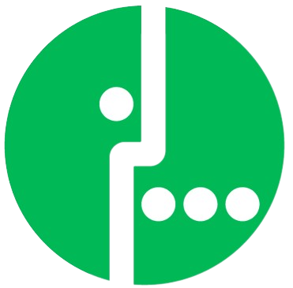

<!-- PROJECT LOGO -->
 

  

  <h3 align="center">Django CRM</h3>

  

    Simple CRM system based on Django framework
     

<!-- ABOUT THE PROJECT -->
## About The Project

The main goal of this project is to use Django framework to implement simple CRM system.

The main functions include:
* Creating a user by an administrator and assigning one of two roles to users (operator or back office specialist)
* User authorization
* Search for requests by client (according to 3 criteria - personal account, full name or phone number)
* Creating/editing and viewing the list of requests/complaints
* Changing the responsible person, the status of the application and the ability to leave a comment by the back office specialist

<!-- BUILT WITH -->
### Built With

* Python
* Django
* PostgreSQL

<!-- CONTACT -->
## Contact

Sulton Abdukadyrov - 1870126525@qq.com

Project Link: https://github.com/Suwentong/django-crm
